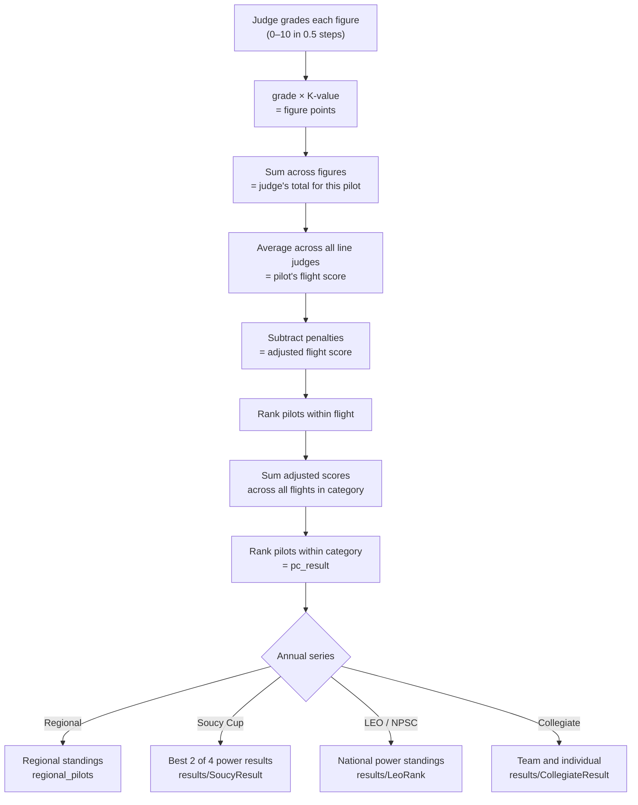

# Scoring Overview

This page gives a high-level narrative of how raw judge grades become final standings. See the [Scoring Engine](../scoring/index.md) section for technical details.

## Score to standing: the pipeline

## Step 1: Judges grade figures

Each line judge assigns a grade (0.0–10.0, in 0.5 steps) to every figure a pilot flies. Special grade values indicate non-standard outcomes:

| Grade | Meaning |
|---|---|
| Positive decimal | Normal grade |
| `-1.0` | Average (A) — judge could not assess the figure |
| `-2.0` | Conference Average (CA) — panel consensus average |
| `-3.0` | Hard Zero (HZ) — safety violation or flown outside the box |

From 2014 onwards, **soft zeros** are supported: a zero grade averaged with the panel instead of zeroed outright.

## Step 2: Grade × K-value = figure points

Each figure in a sequence has a **K-value** (difficulty factor, typically 1–20). A pilot's score for a figure is the grade multiplied by the figure's K-value. The sum across all figures is the pilot's raw score from that judge.

## Step 3: Average across judges

IACCDB averages scores from all line judges to produce a single flight score per pilot (`pf_results.flight_value`). Penalties are then subtracted (`adj_flight_value`).

## Step 4: Flight rankings

Pilots are ranked within each flight by their adjusted flight score (`adj_flight_rank`).

## Step 5: Contest category totals

For categories with multiple flights (Sportsman and above), each pilot's adjusted flight scores are summed to produce their **category value** (`pc_results.category_value`). Pilots are then ranked within the category (`category_rank`).

## Step 6: Annual series

Contest `pc_results` are aggregated by the Regional, Soucy, LEO, and Collegiate jobs to produce annual standings. See [Competition Types](competition-types.md) and [Special Series](../scoring/special-series.md).

## Judge quality metrics

In parallel with pilot results, IACCDB computes quality metrics for each judge measuring how consistently they ranked pilots relative to the panel consensus. See [Judge Metrics](../scoring/judge-metrics.md).
