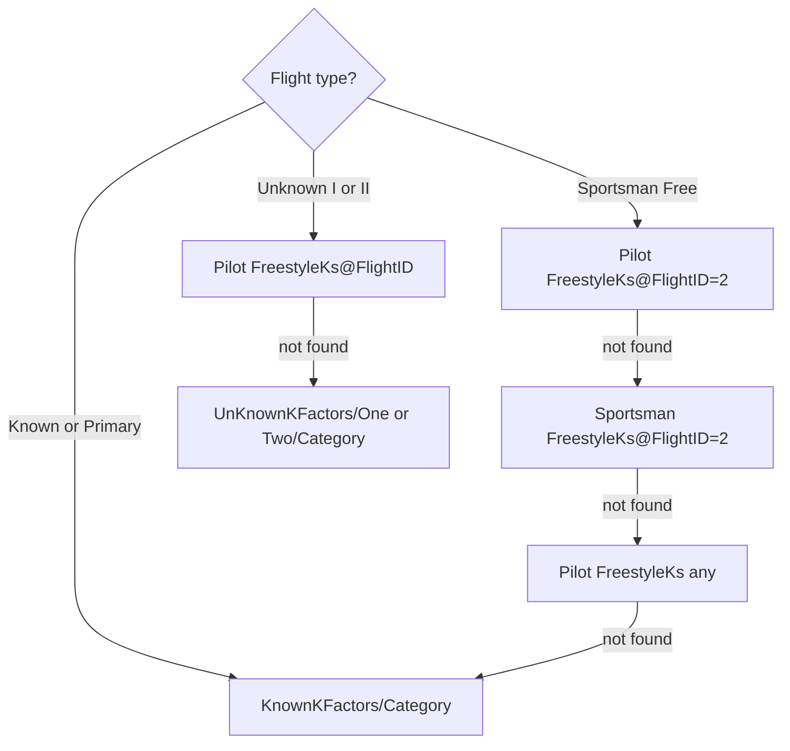

# JasPEr XML Format

**JasPEr** (Judged Aerobatic Scoring Program) is the contest scoring software used by IAC organizers. After a contest, JasPEr exports results as an XML document that is POSTed to IACCDB.

## Submission flow

```mermaid
sequenceDiagram
    participant J as JasPEr / curl
    participant I as IACCDB
    participant Q as delayed_job queue

    J->>+I: POST /admin/jasper<br/>contest_xml=&lt;XML&gt;
    I->>I: Parse XML (JasperParse)
    I->>I: Create or update Contest record
    I->>I: Save DataPost (XML stored to disk)
    I->>Q: Enqueue ProcessJasperJob
    I-->>-J: HTTP 200<br/>&lt;cdbId&gt;42&lt;/cdbId&gt;

    Note over Q,I: Asynchronous background processing
    Q->>I: ProcessJasperJob: import pilots,<br/>judges, scores (JasperToDB)
    Q->>Q: Enqueue ComputeFlightsJob
    Q->>I: ComputeFlightsJob → pf_results, pfj_results
    Q->>Q: Enqueue downstream jobs...
```

## Endpoint

```
POST /admin/jasper
```

**Parameter:** `contest_xml` — the XML string or a file upload.

**Authentication:** HTTP Basic with credentials from the `contest_admin` section of `config/admin.yml`.

**Response (HTTP 200 — accepted):**
```xml
<contest>
  <cdbId>42</cdbId>
</contest>
```

**Response (HTTP 400 — empty body):**
```xml
<exception>no contest data provided</exception>
```

**Response (HTTP 500 — parse error):**
```xml
<exception>... error message ...</exception>
```

### Curl example

```bash
curl -F "contest_xml=@my_contest.xml" \
     --user contest_admin:PASSWORD \
     https://iaccdb.iac.org/admin/jasper
```

A reference Java client is in the repository at `java/ClientPost.java`.

---

## XML document structure

The XML element tree below is derived from the XPath queries in `app/services/jasper/jasper_parse.rb`.

```
ContestResults
  Version
    XMLFormat          (e.g. "1.0")
    JaSPer             (e.g. "3.1.29")
    Generated          (timestamp string)
  ContestInfo
    cdbId              (optional — include to update an existing contest)
    Contest            (name, max 48 chars)
    City               (max 24 chars)
    State              (2-char)
    Date               (MM/DD/YY or YYYY-MM-DD)
    Director           (max 48 chars)
    HostChapter        (chapter number; non-numeric chars stripped)
    Region             (max 16 chars, e.g. "NorthEast", "National")
    Type               (optional; "Powered" or "Glider"; default "Powered")
    Comment            (optional free text)
  KnownKFactors
    Category[@CategoryID]          (space-separated K values for known sequence)
  UnKnownKFactors
    One/Category[@CategoryID]      (K values for Unknown I)
    Two/Category[@CategoryID]      (K values for Unknown II)
  Pilots
    Category[@CategoryID]
      Pilot[@PilotID]
        IACNumber
        Name/First
        Name/Last                  (append "(patch)" to flag hors concours)
        SubCategory                (optional: "HorsConcours" or "CollegiateSeries")
        Chapter                    (optional)
        College                    (optional — collegiate pilots)
        Aircraft/Make
        Aircraft/Model
        Aircraft/NNumber
        FreestyleKs[@FlightID]     (optional; K values for free/unknown flights)
  Judges
    Category[@CategoryID]
      Flight[@FlightID]
        Judge[@JudgeID=0]          (Chief Judge)
          Name/First, Name/Last
          IACNumber
          Assistant[1]/Name/First, Assistant[1]/Name/Last, Assistant[1]/IACNumber
        Judge[@JudgeID=N]          (Line judges, N ≥ 1)
          Name/First, Name/Last
          IACNumber
          Assistant/Name/First, Assistant/Name/Last, Assistant/IACNumber
  Scores
    Category[@CategoryID]
      Flight[@FlightID]
        Pilot[@PilotID]
          Penalty                  (integer; tenths of a point deducted)
          Judge[@JudgeID]          (line judges only — chief does not score)
            Figures                (space-separated grade values)
```

---

## ID mappings

### CategoryID

| CategoryID | Category name |
|---|---|
| 1 | Primary |
| 2 | Sportsman |
| 3 | Intermediate |
| 4 | Advanced |
| 5 | Unlimited |
| 6 | Four Minute |

### FlightID

| FlightID | Flight name |
|---|---|
| 1 | Known |
| 2 | Free |
| 3 | Unknown |
| 4 | Unknown II |

### JudgeID

- `JudgeID="0"` — **Chief Judge** (the flight's `chief_id`; also records `Assistant[1]`)
- `JudgeID="1"`, `"2"`, ... — Line judges (stored in the `judges` join table; provide `<Figures>` in `<Scores>`)

---

## Grade encoding

Grades in `<Figures>` are space-separated decimal values.

| Value | Stored as (×10) | Display | Meaning |
|---|---|---|---|
| `8.5` | `85` | `8.5` | Normal grade |
| `-1.0` | `−10` | `A` | Average — judge could not assess this figure |
| `-2.0` | `−20` | `CA` | Conference Average — panel agreed to average |
| `-3.0` | `−30` | `HZ` | Hard Zero — outside box or safety violation |

From 2014 onwards, a zero grade (`0.0`) is treated as a **soft zero** and averaged with other judges rather than zeroing outright.

---

## K-value lookup rules

The parser uses a priority fallback chain to find K-values for each pilot/flight:



---

## Hors Concours flag

Two ways to mark a pilot HC in the XML:

1. Append `(patch)` (case-insensitive) to `<Last>`:
   ```xml
   <Last>Smith (patch)</Last>
   ```
2. Set `<SubCategory>HorsConcours</SubCategory>`

See [Hors Concours](../concepts/hors-concours.md).

---

## Minimal valid example

```xml
<ContestResults>
  <Version>
    <XMLFormat>1.0</XMLFormat>
    <JaSPer>3.1.29</JaSPer>
    <Generated>Sat May 10 08:00:00 MDT 2025</Generated>
  </Version>
  <ContestInfo>
    <Contest>Spring Classic</Contest>
    <City>Olean</City>
    <State>NY</State>
    <Date>05/10/25</Date>
    <Director>Jane Smith</Director>
    <HostChapter>126</HostChapter>
    <Region>NorthEast</Region>
    <Type>Powered</Type>
  </ContestInfo>
  <KnownKFactors>
    <Category CategoryID="2">14 14 11 15 14 14 15 13</Category>
  </KnownKFactors>
  <Pilots>
    <Category CategoryID="2">
      <Pilot PilotID="1">
        <IACNumber>12345</IACNumber>
        <Name><First>John</First><Last>Doe</Last></Name>
        <Chapter>52</Chapter>
        <Aircraft><Make>Pitts</Make><Model>S-2B</Model><NNumber>N12345</NNumber></Aircraft>
      </Pilot>
    </Category>
  </Pilots>
  <Judges>
    <Category CategoryID="2">
      <Flight FlightID="1">
        <Judge JudgeID="0">
          <Name><First>Alice</First><Last>Chief</Last></Name>
          <IACNumber>54321</IACNumber>
        </Judge>
        <Judge JudgeID="1">
          <Name><First>Bob</First><Last>Panel</Last></Name>
          <IACNumber>11111</IACNumber>
        </Judge>
      </Flight>
    </Category>
  </Judges>
  <Scores>
    <Category CategoryID="2">
      <Flight FlightID="1">
        <Pilot PilotID="1">
          <Penalty>0</Penalty>
          <Judge JudgeID="1">
            <Figures>8.5 9.0 7.5 8.0 8.5 9.0 8.0 8.5</Figures>
          </Judge>
        </Pilot>
      </Flight>
    </Category>
  </Scores>
</ContestResults>
```

!!! note
    The chief judge (`JudgeID="0"`) does not appear in `<Scores>`. Only line judges (`JudgeID ≥ 1`) provide grades.
