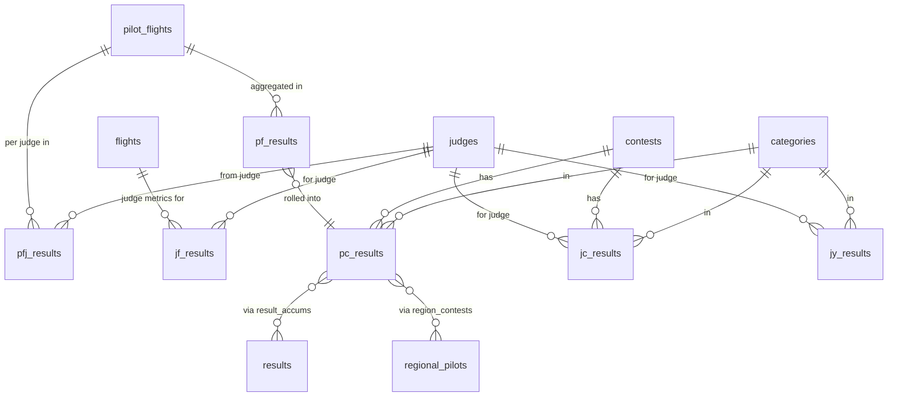

# Computed Result Tables

These tables are populated entirely by background jobs — nothing in them is imported directly. See [Flight Computation](../scoring/flight-computation.md) and [Contest Rollups](../scoring/contest-rollups.md) for how they are produced.

## Result hierarchy

---

## PfResult — Pilot Flight Result

Table: `pf_results`

One pilot's aggregated score for one flight, combining grades from all judges. Belongs to `pilot_flight`.

| Column | Type | Description |
|---|---|---|
| `pilot_flight_id` | integer | FK to `pilot_flights` |
| `flight_value` | decimal (7,2) | Sum of (grade × K) averaged across judges, before penalties |
| `adj_flight_value` | decimal (7,2) | `flight_value` minus `penalty_total` |
| `flight_rank` | integer | Rank among pilots in this flight by raw value |
| `adj_flight_rank` | integer | Rank by adjusted (penalized) value |
| `figure_results` | string | Serialized array — averaged score per figure across all judges (stored ×10) |
| `figure_ranks` | string | Serialized array — this pilot's rank per figure |
| `total_possible` | integer | Maximum possible points (sum of K-values × 10) |
| `need_compute` | boolean | `true` when record needs (re)computation |

---

## PfjResult — Pilot Flight Judge Result

Table: `pfj_results`

One line judge's individual scores for one pilot in one flight. Belongs to `pilot_flight` and `judge`.

| Column | Type | Description |
|---|---|---|
| `pilot_flight_id` | integer | FK to `pilot_flights` |
| `judge_id` | integer | FK to `judges` |
| `computed_values` | string | Per-figure scores after zero adjustments (integers ×10) |
| `computed_ranks` | string | Per-figure ranks after adjustments |
| `graded_values` | string | Per-figure scores as submitted, before adjustments |
| `graded_ranks` | string | Per-figure ranks before adjustments |
| `flight_value` | integer | Sum of this judge's computed scores for this pilot |
| `flight_rank` | integer | This judge's rank for this pilot among all pilots |
| `need_compute` | boolean | Stale flag |

---

## JfResult — Judge Flight Result

Table: `jf_results`

Quality metrics for one judge's performance on one flight. Belongs to `judge` and `flight`. See [Judge Metrics](../scoring/judge-metrics.md) for field meanings.

| Column | Type | Description |
|---|---|---|
| `judge_id` | bigint | FK to `judges` |
| `flight_id` | bigint | FK to `flights` |
| `pilot_count` | integer | Pilots judged |
| `sigma_ri_delta` | decimal (10,5) | Mean absolute rank deviation (consistency) |
| `ri_total` | decimal (10,5) | Sum of rank deviations |
| `con` | integer | Concordant pairs |
| `dis` | integer | Discordant pairs |
| `pair_count` | integer | Total pilot pairs |
| `minority_zero_ct` | integer | Figures where this judge's zero was a minority |
| `minority_grade_ct` | integer | Figures where this judge was a grade outlier |
| `ftsdx2`, `ftsdxdy`, `ftsdy2` | integer | Pearson/Spearman intermediate sums |
| `sigma_d2` | integer | Σ(d²) for Spearman |
| `total_k` | integer | Sum of K-values for all figures judged |
| `figure_count` | integer | Total figures |
| `flight_count` | integer | Number of flights (1 for JfResult) |

---

## JcResult — Judge Contest Result

Table: `jc_results`

Judge metrics aggregated across all flights in one category at one contest. Same columns as `jf_results`, plus:

| Column | Description |
|---|---|
| `contest_id` | FK to `contests` |
| `category_id` | FK to `categories` |
| `flight_count` | Number of flights aggregated |

---

## JyResult — Judge Year Result

Table: `jy_results`

Judge metrics aggregated across an entire year and category. Same columns as `jc_results`, plus:

| Column | Description |
|---|---|
| `year` | Contest year |

---

## PcResult — Pilot Contest Result

Table: `pc_results`

A pilot's result for one category at one contest.

| Column | Type | Description |
|---|---|---|
| `pilot_id` | integer | FK to `members` |
| `contest_id` | bigint | FK to `contests` |
| `category_id` | bigint | FK to `categories` |
| `category_value` | decimal (8,2) | Total points across all flights in the category |
| `category_rank` | integer | Rank among competitive pilots in this category |
| `total_possible` | integer | Maximum possible points |
| `star_qualifying` | boolean | Performance met the star award threshold |
| `hors_concours` | integer | Bitfield HC flags (propagated from pilot_flights) |
| `need_compute` | boolean | Stale flag |

`pc_results` is the central hub of the annual series: Soucy, LEO, Collegiate, and Regional all aggregate from it via `result_accums` and `region_contests`.
