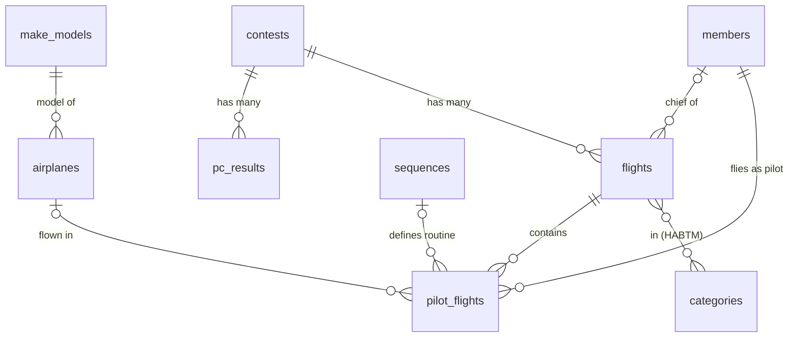
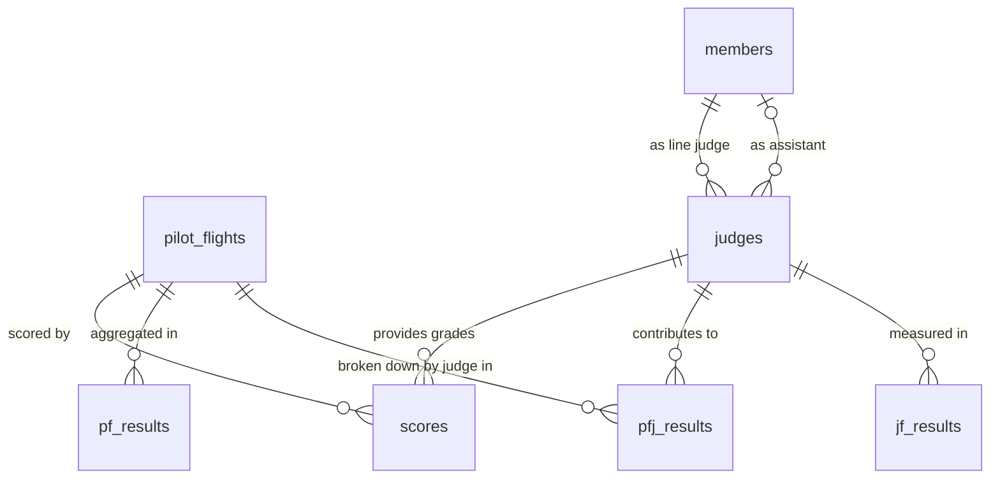

# Core Entities

## Contest and flight structure

The diagram below shows how a contest is organized into flights and how pilots participate. Relationships are drawn from the Active Record associations in the model files.

Key points:
- A `flight` belongs to one `contest` and is associated with one or more `categories` via the `categories_flights` join table.
- `members.chief_id` on `flights` tracks the chief judge (a `Member`). The `judges` table (below) tracks *line* judges only.
- `pilot_flights.sequence_id` and `pilot_flights.airplane_id` are both optional (a pilot's routine or aircraft may not be recorded).

## Judging and scoring structure

!!! warning "Naming confusion: `judges` ≠ list of judge people"
    The `judges` table is a **judge-team join**: each row pairs a line judge member (`judge_id → members`) with an optional assistant (`assist_id → members`). The people themselves are in `members`. See [Judge Teams](judge-team.md).

---

## Member

Table: `members`

Represents any person — pilots, judges, chief judges, assistants. All roles share this one table.

| Column | Type | Description |
|---|---|---|
| `iac_id` | integer | IAC membership number |
| `given_name` | string (40) | First name |
| `family_name` | string (40) | Last name |

Members are found or created by IAC number and name during JasPEr import. Duplicates are merged by administrators.

---

## Contest

Table: `contests`

| Column | Type | Description |
|---|---|---|
| `name` | string (48) | Contest name |
| `city` | string (24) | Host city |
| `state` | string (2) | Two-letter state code |
| `start` | date | Contest start date |
| `chapter` | integer | Hosting IAC chapter number |
| `director` | string (48) | Contest director's name |
| `region` | string (16) | Region identifier (e.g. `NorthEast`, `National`) |
| `busy_start` | date | Start of live-scoring window |
| `busy_end` | date | End of live-scoring window |

---

## Flight

Table: `flights`

| Column | Type | Description |
|---|---|---|
| `contest_id` | integer | Parent contest |
| `name` | string (16) | Flight name (Known, Free, Unknown, Unknown II) |
| `sequence` | integer | Display ordering within the contest |
| `chief_id` | bigint | FK to `members` — the chief judge |
| `assist_id` | bigint | FK to `members` — the chief's assistant (optional) |

A flight is linked to one or more categories via `categories_flights` (has_and_belongs_to_many).

---

## Category

Table: `categories`

| Column | Type | Description |
|---|---|---|
| `category` | string (16) | Category name (e.g. `Sportsman`) |
| `aircat` | string (1) | `P` (Power), `G` (Glider), or `F` (Four Minute) |
| `name` | string (48) | Full display name |
| `sequence` | integer | Display ordering |
| `synthetic` | boolean | True for admin-created synthetic aggregations |

---

## PilotFlight

Table: `pilot_flights`

| Column | Type | Description |
|---|---|---|
| `pilot_id` | bigint | FK to `members` |
| `flight_id` | bigint | FK to `flights` |
| `sequence_id` | bigint | FK to `sequences` — pilot's routine (optional) |
| `airplane_id` | bigint | FK to `airplanes` (optional) |
| `chapter` | string (8) | Pilot's IAC chapter at time of contest |
| `penalty_total` | integer | Total penalty points (stored as tenths, e.g. 10 = 1.0 point) |
| `hors_concours` | integer | Bitfield HC flags (0 = competitive) |

---

## Score

Table: `scores`

| Column | Type | Description |
|---|---|---|
| `pilot_flight_id` | bigint | FK to `pilot_flights` |
| `judge_id` | bigint | FK to `judges` (the judge team record) |
| `values` | string | Serialized array of grade values (stored as integer × 10) |

Grades are stored as integers (e.g. `85` represents `8.5`). Special values: `-10` = Average, `-20` = Conference Average, `-30` = Hard Zero.

---

## Sequence

Table: `sequences`

| Column | Type | Description |
|---|---|---|
| `k_values` | string | Serialized array of K-values (difficulty factors per figure) |
| `figure_count` | integer | Number of figures |
| `total_k` | integer | Sum of all K-values |
| `mod_3_total` | integer | Sum of K-values divisible by 3 |

Sequences are deduplicated — routines with identical K-values share one record.

---

## Airplane / MakeModel

Tables: `airplanes`, `make_models`

| Column | Table | Description |
|---|---|---|
| `reg` | airplanes | N-number / registration |
| `make_model_id` | airplanes | FK to `make_models` |
| `make` | make_models | Manufacturer (e.g. `Pitts`) |
| `model` | make_models | Model name (e.g. `S-2B`) |
| `curated` | make_models | True if an admin has reviewed the data |
