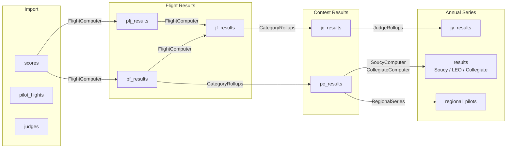

# Data Model Overview

IACCDB uses a MySQL database with 24 tables. The schema is defined authoritatively in `db/schema.rb`.

## Data flow: how raw scores become results

The diagram below shows how data moves from raw import tables through the computed result layers.

## Table index

### Core data tables

| Table | Purpose |
|---|---|
| `members` | All people (pilots, judges, chiefs, assistants) identified by IAC number |
| `contests` | Contest events (name, location, date, director, region) |
| `flights` | Individual scored sessions within a contest |
| `categories` | Competition levels (Primary, Sportsman, etc.) with aircat |
| `categories_flights` | Join table linking flights to categories (HABTM) |
| `pilot_flights` | One pilot's participation in one flight (sequence, airplane, HC flag, penalty) |
| `scores` | Raw judge grades for one pilot/judge/flight combination |
| `sequences` | Aerobatic routines defined by their K-values |
| `airplanes` | Aircraft registration records |
| `make_models` | Aircraft make/model specifications |
| `judges` | Judge team pairs (line judge + optional assistant) — see [Judge Teams](judge-team.md) |

### Computed result tables

| Table | Purpose |
|---|---|
| `pf_results` | Pilot score aggregated across judges for one flight |
| `pfj_results` | Individual judge's contribution to one pilot's flight result |
| `jf_results` | Judge quality metrics for one flight |
| `pc_results` | Pilot result for one category at one contest |
| `jc_results` | Judge quality metrics aggregated across a contest category |
| `jy_results` | Judge quality metrics aggregated across a year and category |

### Annual series tables

| Table | Purpose |
|---|---|
| `results` | STI parent for Soucy, LEO, Collegiate results |
| `result_accums` | Links results to the pc_results that feed them |
| `result_members` | Links team results (Collegiate) to member pilots |
| `regional_pilots` | Pilot standing in one region/year/category |
| `region_contests` | Links regional_pilots to contributing pc_results |

### Supporting tables

| Table | Purpose |
|---|---|
| `data_posts` | Record of every JasPEr XML submission with status and error info |
| `manny_synches` | Records of Manny system retrievals |
| `failures` | Error log for data processing failures |
| `free_program_ks` | Maximum K factor allowed per category per year |
| `synthetic_categories` | Definitions of custom category aggregations |
| `delayed_jobs` | Background job queue (managed by delayed_job gem) |
