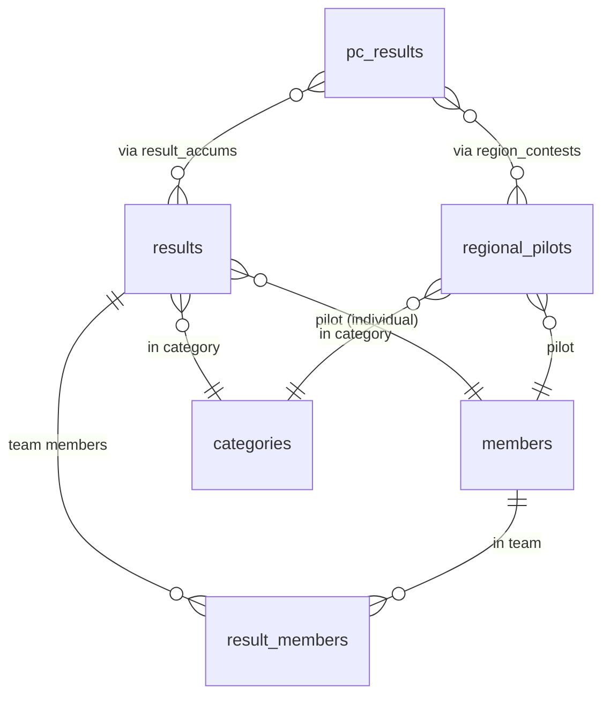

# Special Result Tables

These tables record annual series standings computed from `pc_results`.

## Annual series structure

## Results (STI parent)

Table: `results`

Uses Rails Single Table Inheritance. The `type` column identifies which series each row belongs to.

| Column | Type | Description |
|---|---|---|
| `type` | string | STI discriminator (see subclasses below) |
| `year` | integer | Competition year |
| `category_id` | bigint | FK to `categories` |
| `pilot_id` | bigint | FK to `members` (primary pilot or team contact) |
| `region` | string | Region identifier (for regional results) |
| `name` | string | Team name (for Collegiate results) |
| `qualified` | boolean | Met the qualification threshold |
| `rank` | integer | Final standing |
| `points` | decimal (9,2) | Total points or percentage |
| `points_possible` | integer | Maximum possible points |

### STI subclasses

| `type` value | Series |
|---|---|
| `SoucyResult` | Soucy Cup — best two of four power contests |
| `LeoRank` | LEO / NPSC — national power rankings |
| `LeoPilotContest` | Individual contest contribution to LEO |
| `CollegiateResult` | Collegiate team result |
| `CollegiateIndividualResult` | Individual collegiate pilot result |

---

## ResultAccum

Table: `result_accums`

Links a `Result` record to each `PcResult` that contributes to it. Allows the system to know which contest results were used in computing a series standing, and to update the standing when a contest result changes.

---

## ResultMember

Table: `result_members`

Links team results (`CollegiateResult`) to each `Member` on the team. A single `CollegiateResult` can have multiple `result_members`.

---

## RegionalPilot

Table: `regional_pilots`

A pilot's standing in one regional series for one year and category.

| Column | Type | Description |
|---|---|---|
| `pilot_id` | bigint | FK to `members` |
| `category_id` | bigint | FK to `categories` |
| `region` | string (16) | Region identifier |
| `year` | integer | Competition year |
| `percentage` | decimal (5,2) | Average percentage of possible points across contests |
| `qualified` | boolean | Met minimum contest participation threshold |
| `rank` | integer | Standing within region/category/year |

## RegionContest

Table: `region_contests`

Join table linking each `RegionalPilot` record to the `PcResult` records that contributed to it. One `RegionalPilot` has one `RegionContest` per contest attended in the region.
