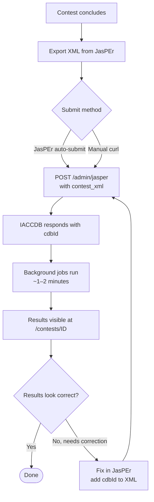

# For Contest Organizers

This guide explains how to submit contest results to IACCDB after your contest concludes.

## Submission flow



## What you need

- JasPEr scoring software (used during your contest)
- The IACCDB submission URL and credentials (provided by IAC HQ)
- The JasPEr-generated XML export file

## Step 1: Export from JasPEr

After all grades are entered:

1. Use JasPEr's export/submit function to generate the contest results XML.
2. Verify the file contains all categories and flights.

## Step 2: Submit

**Option A: JasPEr submits automatically**

Modern JasPEr versions can POST results directly. Configure the submission URL in JasPEr's settings.

**Option B: Manual curl**

```bash
curl -F "contest_xml=@ContestResults.xml" \
     --user contest_admin:YOUR_PASSWORD \
     https://iaccdb.iac.org/admin/jasper
```

The response contains the contest's database ID:

```xml
<contest>
  <cdbId>42</cdbId>
</contest>
```

**Option C: Java client**

See `java/ClientPost.java` in the repository.

## Step 3: Verify

1. Navigate to `https://iaccdb.iac.org/contests/42` (use your actual `cdbId`).
2. Confirm name, date, location, categories are correct.
3. Results appear within 1–2 minutes as background jobs complete.

!!! note "Processing is asynchronous"
    The response comes back immediately with the `cdbId`. Computation (rankings, judge metrics, series standings) happens in the background.

## Correcting a submission

Fix the data in JasPEr, then add `<cdbId>42</cdbId>` inside `<ContestInfo>` in the XML before resubmitting. This updates the existing contest rather than creating a duplicate.

If something went wrong, check **Admin → Data Posts** for error details and **Admin → Failures** for processing errors.

## Hors Concours pilots

Mark a pilot HC by appending `(patch)` (case-insensitive) to their last name in JasPEr:

```
Last name: Smith (patch)
```

Or use `<SubCategory>HorsConcours</SubCategory>`. See [Hors Concours](../concepts/hors-concours.md).

## Live scoring during the contest

IACCDB can display partial results as flights complete. Ask IAC HQ to set `busy_start` / `busy_end` on the contest. Once enabled, submit a JasPEr export after each flight — results update immediately.
