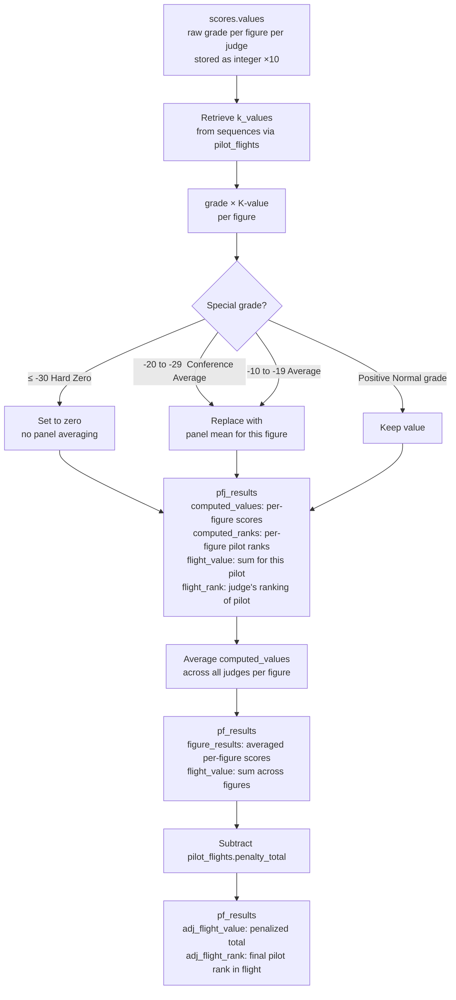

# Flight Computation

Flight computation transforms raw judge grades into per-pilot and per-judge flight results. It is performed by `FlightComputer` (`app/services/flight_computer.rb`), called from `ContestComputer`.

## Grade → flight result pipeline

## compute_pf_results

For each pilot in a flight, and for each line judge who scored that pilot:

1. Read `scores.values` (serialized integer array, each value is grade × 10)
2. Read `sequences.k_values` via `pilot_flights.sequence_id`
3. Multiply each grade by the corresponding K-value
4. Apply zero/average substitution rules (see grade encoding below)
5. Write one `pfj_results` record per (pilot, judge) pair containing per-figure and total scores
6. Average the per-figure scores across all judges to produce `pf_results.figure_results`
7. Sum the averaged figure scores to produce `pf_results.flight_value`
8. Subtract `pilot_flights.penalty_total` to produce `pf_results.adj_flight_value`
9. Rank all pilots in the flight to produce `pf_results.flight_rank` and `adj_flight_rank`

## compute_jf_results

Requires `pf_results` and `pfj_results` to exist. For each judge on a flight:

1. Retrieve the consensus pilot ranking from `pf_results.flight_rank` (the panel average result)
2. Retrieve this judge's ranking from `pfj_results.flight_rank`
3. Compute rank deviations and statistical accumulators (Σd², concordant/discordant pairs, etc.)
4. Write one `jf_results` record

See [Judge Statistics](judge-statistics.md) for the formulas used.

## Grade encoding

Grades in `scores.values` are stored as integer × 10. The display conversion (from `Score.display_score`) is:

| Stored value | Display | Meaning |
|---|---|---|
| ≤ −30 | `HZ` | Hard Zero — figure outside box or safety violation |
| −20 to −29 | `CA` | Conference Average — panel agreed to average this figure |
| −10 to −19 | `A` | Average — this judge could not assess the figure |
| 0 | `0.0` | Zero grade |
| Positive | Decimal | Normal grade, e.g. `85` → `8.5` |

From 2014 onwards (`contest.has_soft_zero` returns true), a stored zero is treated as a soft zero: it is averaged with the other judges' grades rather than hard-zeroed.
