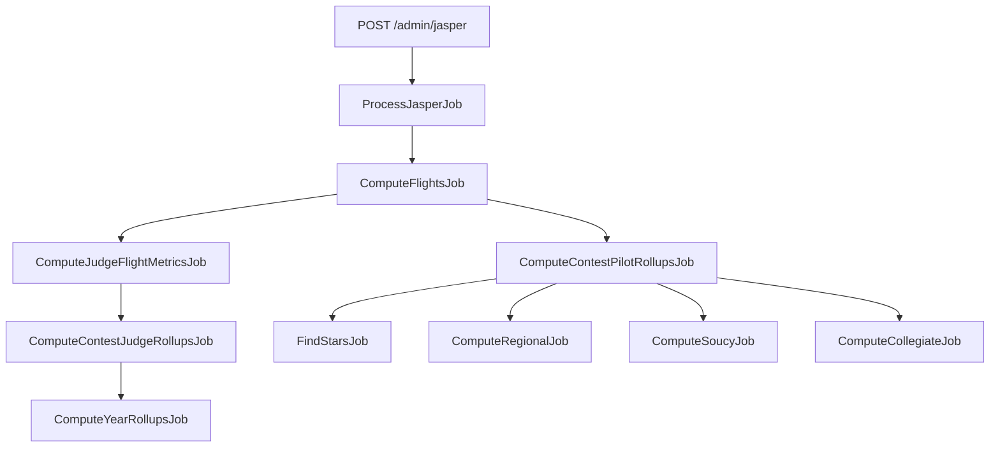
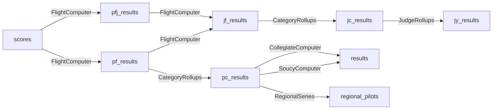

# Scoring Engine: Pipeline Overview

IACCDB computes results through a chain of background jobs triggered automatically after contest data is imported.

## Job dependency chain

Each job enqueues the next one(s) after it completes. Two branches run in parallel after `ComputeFlightsJob`: one for pilot results and one for judge metrics.

## Data dependency graph

The diagram below shows which database tables feed each computation step. Arrows are labeled with the service class that performs the transformation.

`FindStars` also reads `pc_results` and updates the `star_qualifying` flag on the same records.

## Job details

### ProcessJasperJob (or RetrieveMannyJob)

Triggered when a JasPEr XML POST is received or a Manny retrieval is started. Calls `JasperToDB` (or `MannyToDB`) to write the contest, flights, pilot_flights, judges, and scores to the database. Then enqueues **ComputeFlightsJob**.

### ComputeFlightsJob

Calls `ContestComputer.compute_flights`. For each flight, calls `FlightComputer.compute_pf_results`, which writes `pf_results` and `pfj_results`. Then enqueues **ComputeJudgeFlightMetricsJob** and **ComputeContestPilotRollupsJob**.

### ComputeJudgeFlightMetricsJob

Calls `ContestComputer.compute_judge_metrics`. For each flight, calls `FlightComputer.compute_jf_results`, which writes `jf_results`. Then enqueues **ComputeContestJudgeRollupsJob**.

### ComputeContestPilotRollupsJob

Calls `ContestComputer.compute_contest_pilot_rollups`. For each category, calls `CategoryRollups.compute_pilot_category_results` and `compute_category_ranks`, which write `pc_results`. Then enqueues **FindStarsJob**, **ComputeRegionalJob**, **ComputeSoucyJob**, and **ComputeCollegiateJob**.

### ComputeContestJudgeRollupsJob

Calls `ContestComputer.compute_contest_judge_rollups`. For each category, calls `CategoryRollups.compute_judge_category_results`, which writes `jc_results`. Then enqueues **ComputeYearRollupsJob**.

### ComputeYearRollupsJob

Calls `JudgeRollups.compute_jy_results(year)`, aggregating all `jc_results` for the year into `jy_results`.

### FindStarsJob

Calls `FindStars.find_stars(contest)`. Updates `pc_results.star_qualifying` for pilots who met the threshold.

### ComputeRegionalJob / ComputeSoucyJob / ComputeCollegiateJob

Recompute the annual series standings for the affected year. See [Special Series](special-series.md).

## Recomputation

An administrator can trigger recomputation for a specific contest from **Admin → Contests → Recompute**. This re-enqueues the full job chain from ComputeFlightsJob onward.

## Stale flags

`pf_results`, `pfj_results`, and `pc_results` have a `need_compute` boolean column. When `true`, the record exists but has not yet been computed or is stale. Background jobs set it to `false` after writing.
